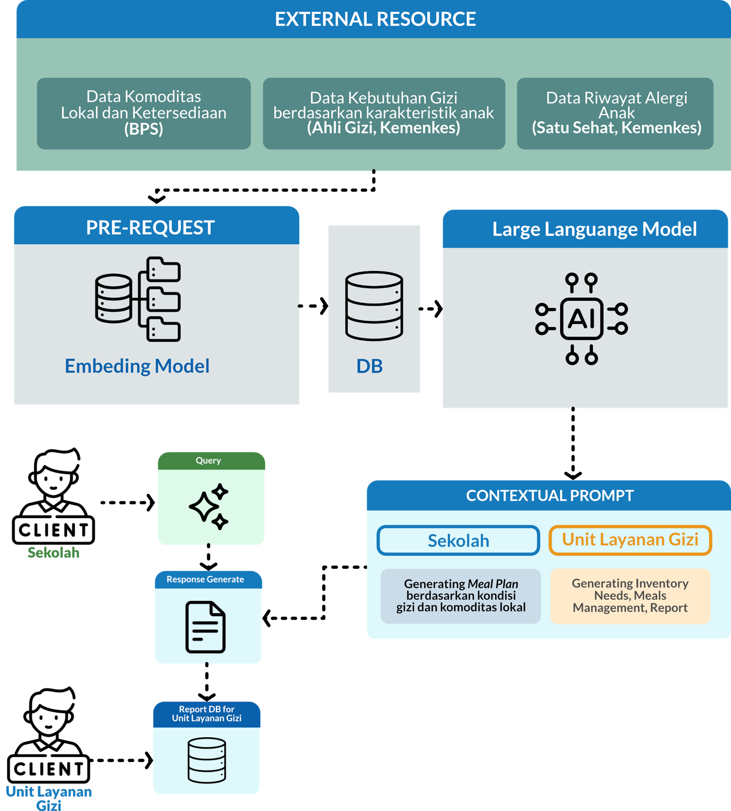
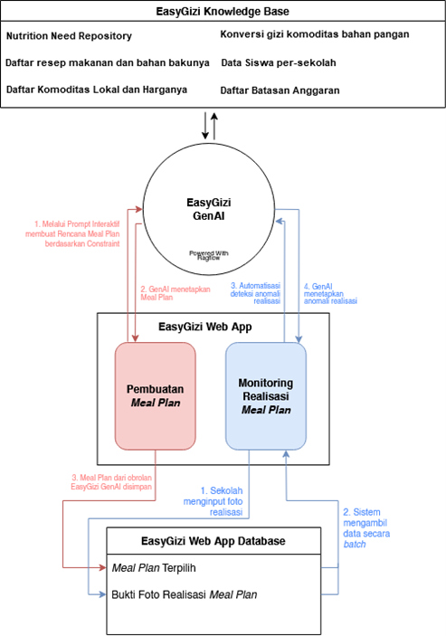
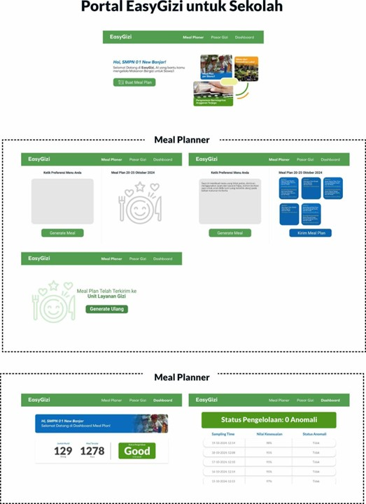
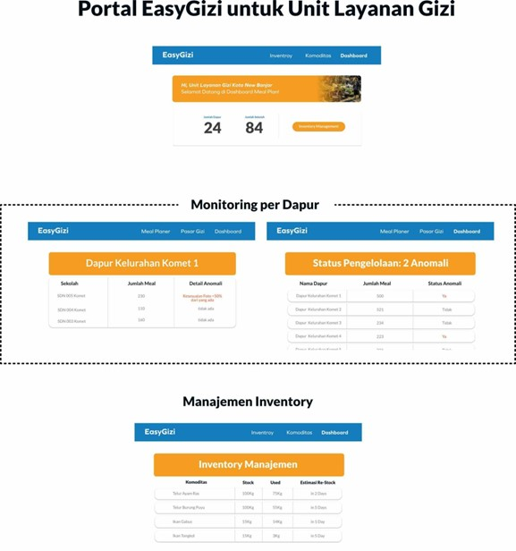

  <h1><b>PROPOSAL GOV-AI HACKATHON</b></h1>
  <h2><b>EasyGizi</b></h2>
  
  
<b>Generative AI dalam Sistem Pengelolaan Program Makan Bergizi Gratis yang Efektif, Transparan, dan Memberdayakan Komoditas Lokal</b>

  <h3><b>Kelompok 63</b></h3>
  
<b>Hakiki Sandhika Raja</b>

  
<b>Gibran Sansadewa Asshadiqi</b>

  
<b>Fitri Handayani</b>

  
<b>Budhi Fatanza Wiratama</b>

---

  <h2><b>Pendahuluan</b></h2>
  
Presiden Indonesia telah meluncurkan program Makan Bergizi Gratis (MBG) yang rencananya akan berlangsung mulai 2 Januari 2025. Program ini bertujuan untuk meningkatkan asupan gizi anak sekaligus berkontribusi pada perubahan sosial yang inklusif dan merata, serta meningkatkan kualitas dan akses pendidikan bagi semua lapisan masyarakat (Kartika & Hermawan, 2024). Saat ini, skema yang tengah diuji coba pemerintah adalah dengan membentuk Satuan Layanan Program MBG tingkat wilayah untuk mengelola dapur dan kualitas makanan, serta distribusinya ke sekolah. Namun, pengelolaan di tingkat wilayah akan dihadapkan pada masalah manajemen yang kompleks serta sistem kontrol dan monitoring yang tidak optimal (Gresse, 2024). Terutama bagi Indonesia dengan wilayah yang luas dan kondisi geografis yang beragam.

  <h2><b>Masalah yang Dihadapi</b></h2>
  <ul>
    <li>Jika dapur umum hanya terdapat di Satuan Pelayanan pada tingkat kabupaten/kota, terdapat desa/kecamatan dengan durasi akses yang terlalu lama dari ibukota kabupaten/kota.</li>
    <li>Makan Bergizi Gratis bagi anak perlu memperhatikan kecukupan gizi harian sebagaimana diatur dalam Permenkes No 28 Tahun 2019 tentang Angka Kecukupan Gizi, padahal tidak setiap sekolah memiliki ahli gizi.</li>
    <li>Perlunya bahan makanan dalam jumlah yang masif dan tersebar di seluruh wilayah dengan sekolah, sehingga pemanfaatan komoditas lokal sangat diperlukan agar lebih berdampak bagi perekonomian.</li>
    <li>Monitoring pelaksanaan Makan Bergizi Gratis berkaitan dengan kesesuaian makanan yang didistribusikan dan dikonsumsi oleh anak di sekolah.</li>
  </ul>

  <h2><b>Solusi yang Ditawarkan</b></h2>
  
Berdasarkan latar belakang serta masalah yang muncul, perlu dibentuk sebuah sistem yang mengelola pelaksanaan Program Makan Bergizi, kaitannya dalam proses perencanaan menu yang tepat dan kesesuaian pelaksanaannya. Sebuah sistem berbasis AI dapat mempermudah beberapa bagian pelaksanaan dalam program ini:

  <ul>
    <li><b>Pembuatan opsi menu (Meal Plan) yang tepat:</b> Dengan bantuan Generative AI, menu makanan yang tepat ini bukan hanya memperhatikan standar angka kecukupan gizi, namun juga kondisi fisik anak yang akan mempengaruhi kebutuhan gizinya, alergi, serta faktor sosial ekonomi seperti ketersediaan dan potensi komoditas lokal yang dapat digunakan sebagai bahan pembuatan makanan, titik keseimbangan harga bahan makanan dan anggaran program, serta pertimbangan dari efek limpahan ekonomi yang dihasilkan dari belanja bahan makanan yang masif dalam program ini.</li>
    <li><b>Monitoring kesesuaian Menu:</b> Generative AI juga akan membaca dokumentasi pelaksanaan program ini dalam bentuk foto yang diunggah oleh sekolah, untuk membantu mengidentifikasi kesesuaian pelaksanaan yang telah terealisasi dengan yang sebelumnya direncanakan. Sistem ini akan mendeteksi apabila ada menu yang terindikasi tidak memenuhi standar yang telah ditentukan, atau apakah pelaksanaan tidak berjalan seperti yang diharapkan.</li>
  </ul>

  <h2><b>Dampak dan Manfaat</b></h2>
  
AI yang dirancang dalam sistem ini bertujuan untuk menyukseskan pelaksanaan program MBG serta memastikan efektivitasnya di seluruh wilayah Indonesia. Beberapa dampak dan manfaat yang dapat diperoleh dari penggunaan AI ini sebagai berikut.

  <ul>
    <li>Sekolah dapat menyediakan menu bergizi sesuai standar nasional dengan adanya keterbatasan kehadiran ahli gizi di masing-masing sekolah tersebut.</li>
    <li>Penggunaan AI dapat meningkatkan transparansi dan akuntabilitas program karena memungkinkan pemantauan dan pelaporan secara real-time oleh pemangku kebijakan. Selain itu, melalui AI, mereka dapat mengakses laporan harian dan mengidentifikasi masalah dengan cepat.</li>
    <li>Dengan rekomendasi menu yang berbasis komoditas lokal, AI mendukung peningkatan permintaan produk pangan dari daerah sekitar sekolah, memberikan dampak positif pada ekonomi lokal dan mendukung upaya pemerintah dalam pembangunan ekonomi berkelanjutan.</li>
    <li>Data yang dihasilkan AI menyediakan informasi yang dapat diandalkan bagi pemangku kebijakan untuk melakukan penyesuaian cepat terhadap strategi program yang menjadikannya program yang lebih adaptif dan responsif terhadap kebutuhan masyarakat.</li>
  </ul>

  <h2><b>Nilai Bisnis</b></h2>
  
Penerapan AI dalam program MBG tidak hanya memberikan manfaat bagi siswa, tetapi juga menawarkan nilai bisnis yang signifikan. Dengan memanfaatkan teknologi AI, sekolah dapat meningkatkan efisiensi operasional, mengoptimalkan penggunaan anggaran, dan memperkuat pengambilan keputusan berbasis data.

  <ul>
    <li><b>Efisiensi Operasional:</b> AI mengotomatiskan proses seperti perencanaan menu dan pemantauan persediaan, mengurangi beban administratif, dan memungkinkan staf fokus pada pendidikan.</li>
    <li><b>Optimalisasi Anggaran:</b> Dengan menganalisis data konsumsi, AI membantu sekolah merencanakan pengeluaran secara lebih efisien, menghindari pemborosan, dan memastikan keberlanjutan program.</li>
    <li><b>Pengambilan Keputusan Berbasis Data:</b> AI memberikan wawasan real-time mengenai kebutuhan gizi siswa sehingga memungkinkan pengambil keputusan untuk menyesuaikan menu sesuai kebutuhan secara cepat.</li>
  </ul>

  <h2><b>Implementasi</b></h2>
  <h3><b>6.1 Kebutuhan Teknis</b></h3>
  <ul>
    <li><b>Penggunaan Generative AI:</b> Teknologi AI dirancang untuk menganalisis data gizi, kondisi fisik siswa, serta ketersediaan komoditas lokal. Dengan kemampuan menghasilkan rekomendasi menu yang sesuai, AI membantu sekolah dalam merancang makanan bergizi yang sesuai dengan kebutuhan siswa dan anggaran yang tersedia.</li>
    <li><b>Database Gizi:</b> Membangun database yang komprehensif mengenai kebutuhan gizi siswa, bahan makanan lokal, dan standar gizi. Database ini akan menjadi referensi bagi AI dalam menyusun rekomendasi menu yang sesuai.</li>
    <li><b>Monitoring dan Evaluasi:</b> Untuk menjaga kualitas gizi pada menu yang tersaji, diperlukan adanya pengawasan dalam bentuk monitoring dan evaluasi yang dapat dirincikan pada dua user:
      <ul>
        <li><b>Sekolah:</b> Sistem menyediakan tampilan untuk memungkinkan sekolah melakukan pelaporan menu secara rutin sesuai dengan rekomendasi yang diberikan oleh AI.</li>
        <li><b>Satuan Layanan Program MBG:</b> Satuan Layanan Program MBG memerlukan alat untuk melakukan evaluasi berkelanjutan terhadap efektivitas program di sekolah-sekolah. AI akan menyediakan sistem agar Satuan Layanan Program MBG dapat mengakses menu yang disajikan sekolah untuk menilai kesesuaian makanan yang didistribusikan dan memastikan standar gizi terpenuhi.</li>
      </ul>
    </li>
  </ul>

  <h3><b>6.2 Pemangku Kepentingan</b></h3>
  <ul>
    <li><b>Badan Gizi Nasional:</b> Mengintegrasikan standar gizi ke dalam sistem AI, memastikan bahwa rekomendasi menu yang dihasilkan sesuai dengan angka kecukupan gizi nasional.</li>
    <li><b>Satuan Layanan Program MBG:</b> Menggunakan AI dalam perannya sebagai pengawas untuk memantau dan mengevaluasi pelaksanaan program di sekolah secara real-time, memastikan kepatuhan terhadap standar gizi dan efektivitas program.</li>
    <li><b>Sekolah:</b> Sebagai perpanjangan tangan Satuan Layanan Program MBG, sekolah menggunakan AI untuk mengakses data gizi, menyusun menu sesuai rekomendasi, serta melaporkan pelaksanaan program, dan memastikan bahwa setiap siswa mendapat asupan sesuai kebutuhan.</li>
    <li><b>Badan Pusat Statistik:</b> Penyedia data makro untuk knowledge base AI.</li>
  </ul>

  <h3><b>6.3 Waktu Implementasi</b></h3>
  
Untuk membangun sistem EasyGizi diperlukan waktu sekitar 2 bulan yang mencakup beberapa tahapan. Pertama, pembuatan EasyGizi generative AI beserta knowledgebase-nya dalam rentang waktu 1 bulan. Pembuatan sistem aplikasi berbasis web EasyGizi untuk para pengguna yang terintegrasi terhadap generative AI yang dibuat dalam waktu 1 bulan.

  <h2><b>Kesimpulan</b></h2>
  
Mekanisme distribusi program MBG yang diterapkan pemerintah dengan skema melalui Satuan Layanan Program MBG mengalami tantangan dengan kondisi geografis Indonesia yang luas. Oleh karena itu, peran sekolah sebagai perpanjangan tangan menjadi penting dengan didukung oleh sistem EasyGizi berbasis AI. Melalui EasyGizi, sekolah dapat menyediakan menu yang sesuai dengan kebutuhan siswa dan komoditas lokal, sehingga memungkinkan pelaksanaan program secara efisien, tepat sasaran, dan sesuai anggaran. Sistem AI juga memungkinkan Satuan Layanan Program MBG untuk melakukan pengawasan dan evaluasi menyeluruh, memastikan kepatuhan standar gizi dan kesesuaian pelaksanaan program di setiap sekolah. Dengan integrasi AI ini, program MBG tidak hanya lebih responsif dan terukur, tetapi juga memberikan dampak signifikan pada efisiensi operasional, pengelolaan anggaran, serta peningkatan kualitas hidup siswa di seluruh Indonesia.

  <h2><b>Lampiran</b></h2>
  <h3><b>Links</b></h3>
  

    
  

  

  <h3><b>Arsitektur Sistem</b></h3>
    
  

  

  <h3><b>Alur Sistem</b></h3>
    
  

  

  <h3><b>Mockup</b></h3>
    
    
  

---

  <h2><b>Referensi</b></h2>
  <ul>
    <li>Gresse, A. (2024). <i>School Nutrition Programmes in the Sustainable Food Systems Value Chain</i>. The Journal of Nutrition & Dietetics.</li>
    <li>Kartika, S.D. & Hermawan, A. (2024). <i>Perspektif Kebijakan dan Anggaran dari Program Makan Bergizi Gratis</i>. Jakarta Pusat. Isu Sepekan Pusat Analisis Keparlemenan Badan Keahlian Setjen DPR RI.</li>
    <li>McIsaac, J.D., dkk. (2018). <i>Factors Influencing the Implementation of Nutrition Policies in Schools: A Scoping Review</i>. Health Education & Behavior 1–27.</li>
    <li>Valaitis, R.F., dkk. (2013). <i>Programme coordinators’ perceptions of strengths, weaknesses, opportunities and threats associated with school nutrition programmes</i>. Public Health Nutrition. Cambridge University Press.</li>
  </ul>

